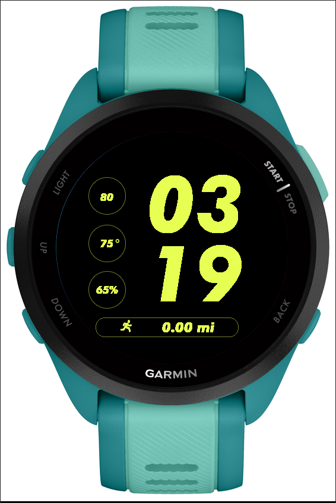
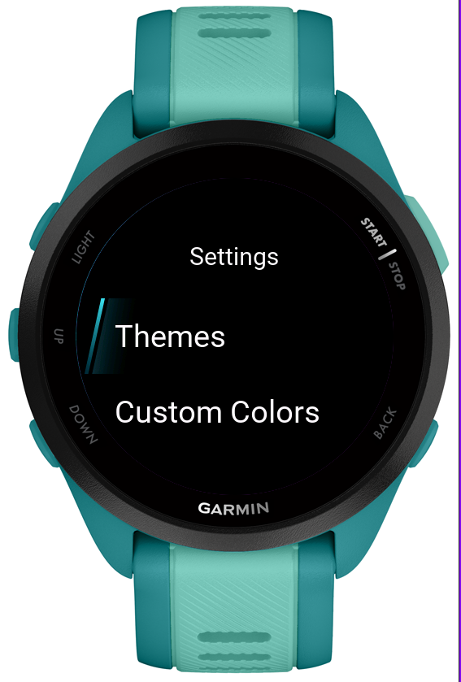
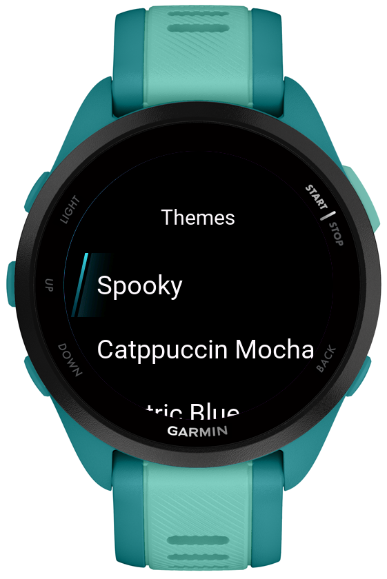
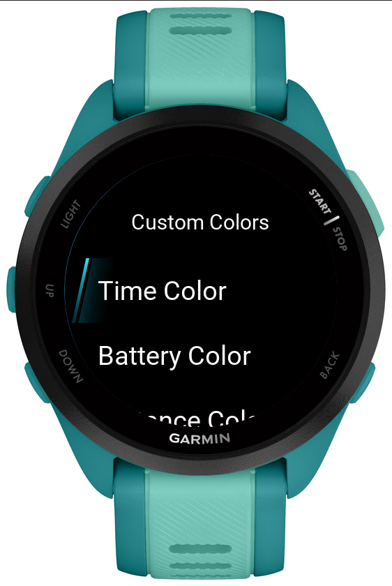
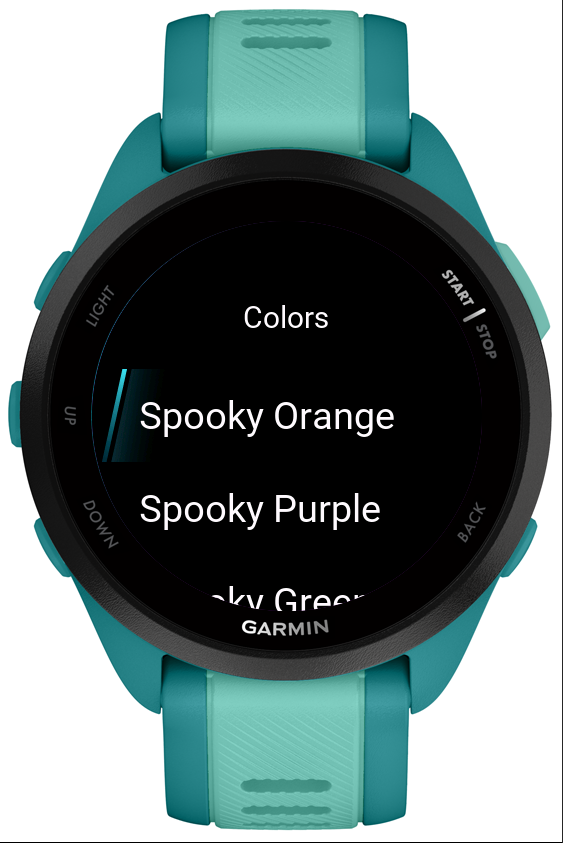
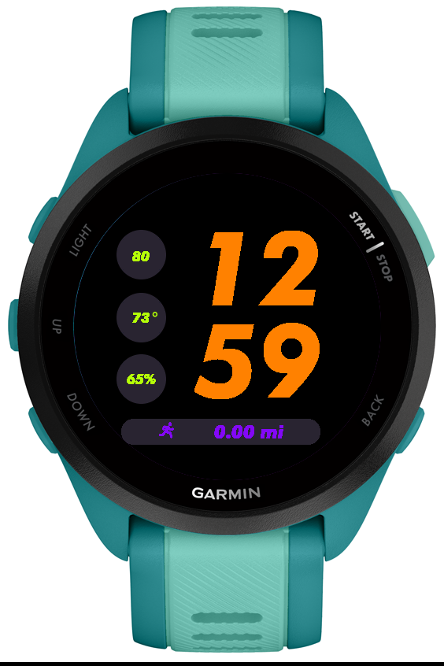
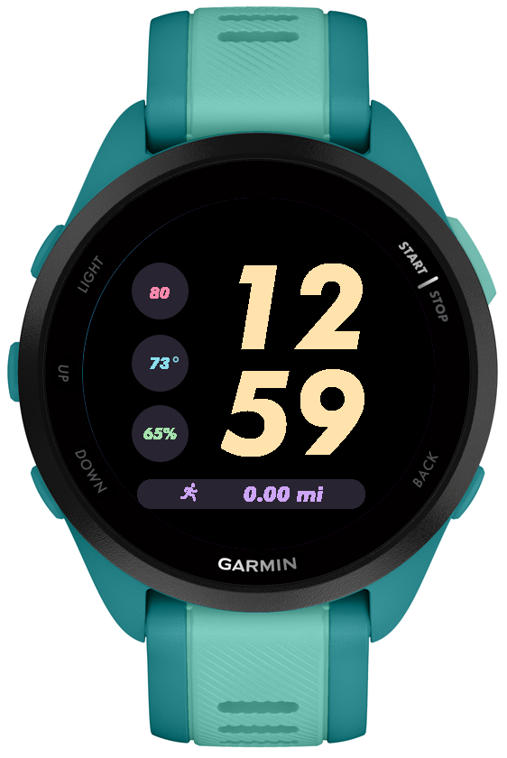
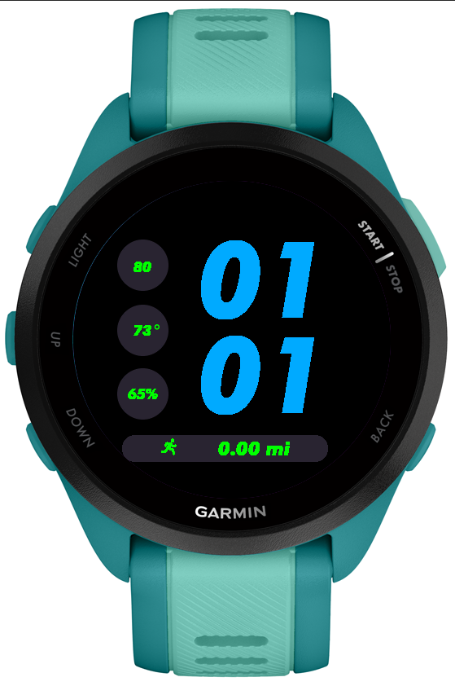

# **Minimal Garmin Watchface**

### **Description**
This is a Garmin Watchface I built using Monkey C. This watchface is inspired by the Nike watchfaces that are available on the Apple Watch.
I created this watchface to run on my Garmin Forerunner 165 Music (and I am currently using this watchface). The Forerunner 165 Music is the only Garmin watch I own, so it has only been tested on the Forerunner 165 Music model. 

### **Data Fields**
- *Battery*
- *Temperature*
- *Heart Rate*
- *Weekly Running Distance (in miles)*

### **On-Device Settings**
- *Built in themes for the user to easily choose from*
- *Color customization for any data field from set color list*
- *Customization can be applied with the on-device watch face customization menu*

 
 

### **Themes**
- *Neon*
- *Spooky*
- *Catppuccin Mocha*
- *Blue Electric*

 
 
